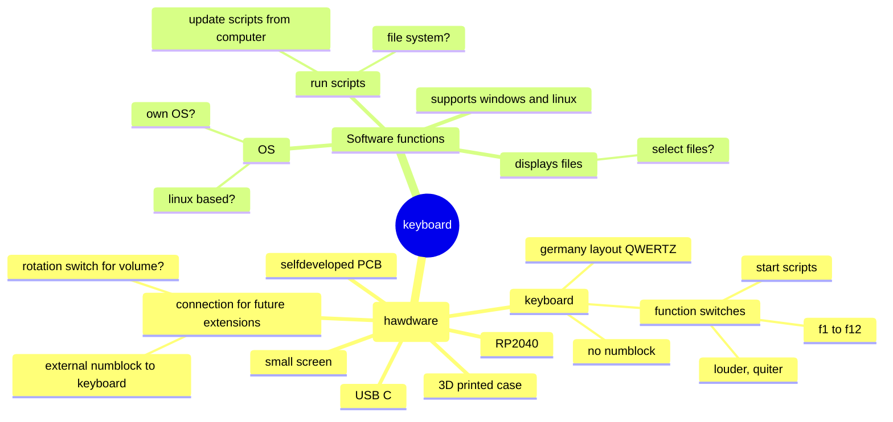

# Overview
 In this project i want to develop my own keyboard. One goal of the project is to learn some basics with microcontroller, operating systems and peripherals. One inspiration is this keyboard: https://sagaklabs.com/products/bitt101

# Requirements

